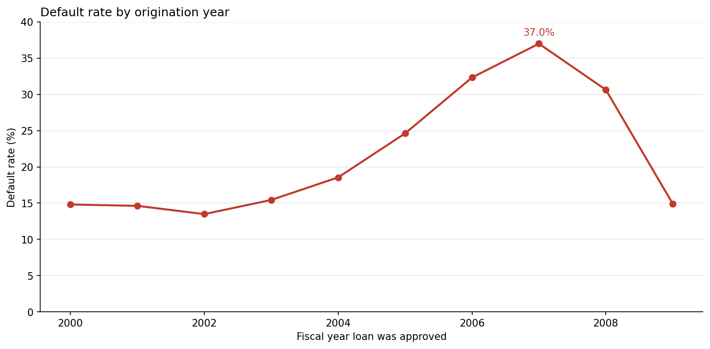
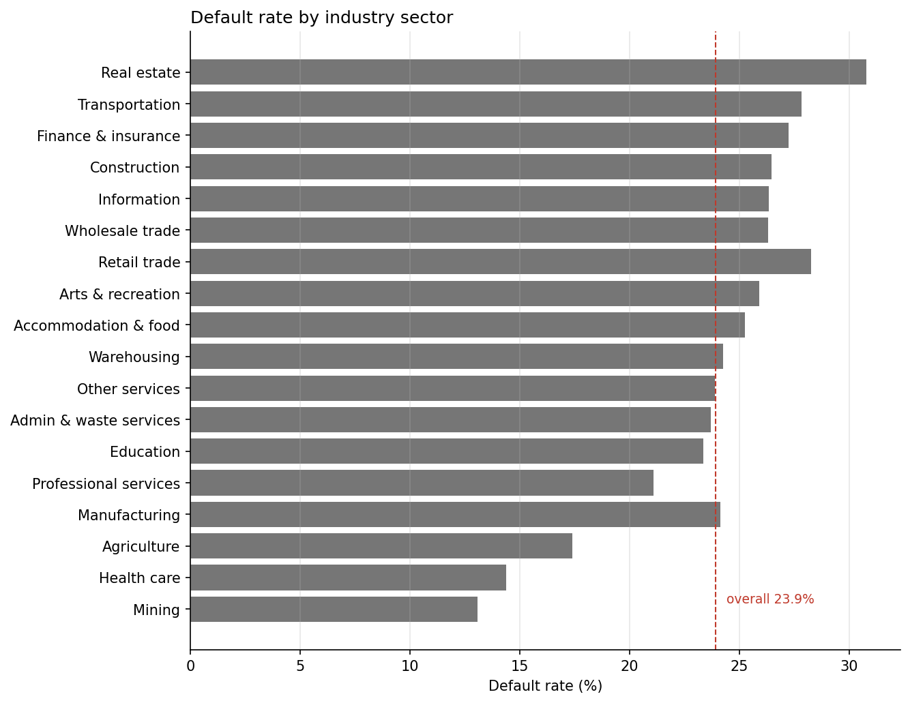
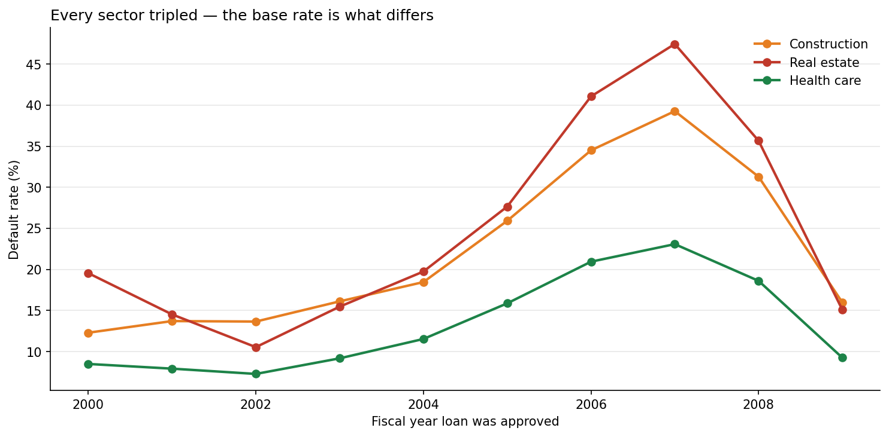
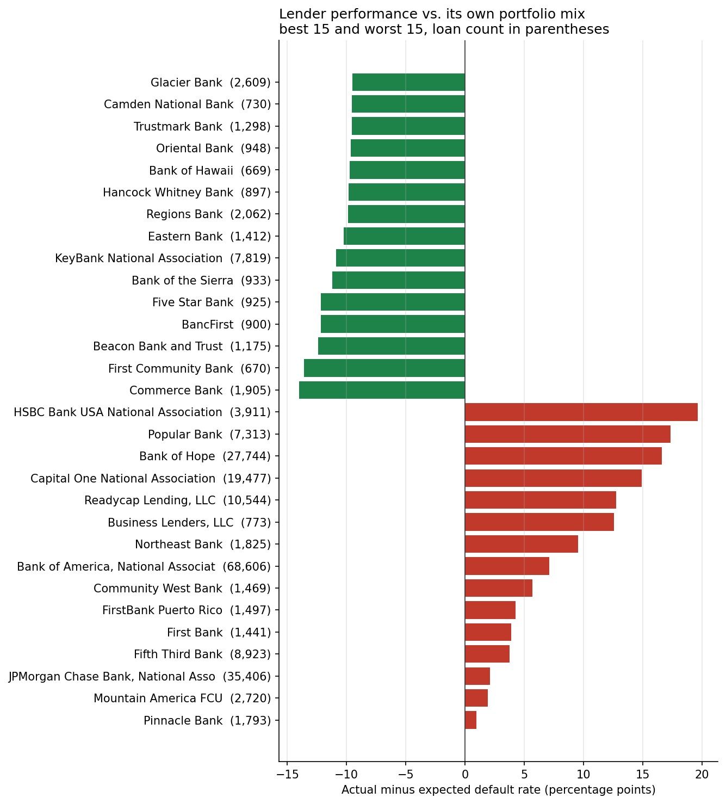
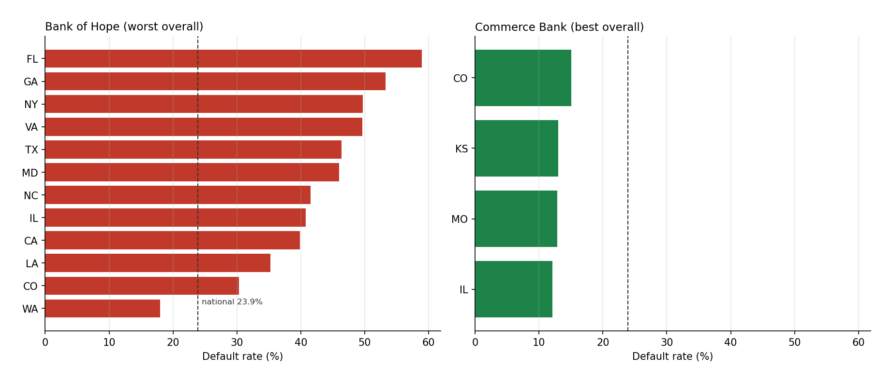
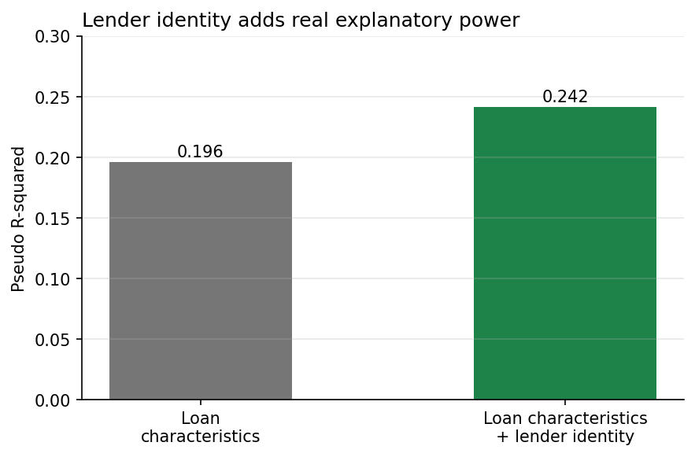
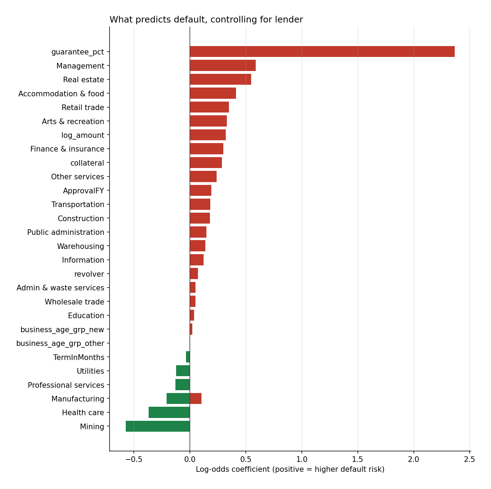

# Which Lenders Underwrite Better Than Their Loan Book Suggests?

An analysis of 604,573 SBA 7(a) small business loans originated between FY2000 and FY2009, using SQL to isolate lender performance from portfolio composition and a logistic regression to test whether the result survives simultaneous controls.

**Data:** [SBA 7(a) FOIA loan-level file](https://data.sba.gov/dataset/7-a-504-foia), FY2000–FY2009.

---

## The question

Ranking lenders by raw default rate mostly measures *what and when they lent*, not how well they underwrote. A bank that lent heavily to real estate developers in 2007 will look terrible even if it screened borrowers carefully, because real estate loans from 2007 failed at 47%.

The question worth asking is: **given the industries, years, and loan types in a lender's book, did it do better or worse than that mix predicts?**

## Setting up the controls

Before comparing lenders, two things had to be measured.

**Vintage dominates.** Default rates ran 13.5% for FY2002 originations, climbed to **37.0% for FY2007**, then fell back to 14.9% by FY2009. Loans made at the top of the cycle hit the recession partway through their term.



**Industry matters, but less than it first appears.** Real estate (30.8%) and construction (26.5%) top the raw sector ranking, while health care (14.4%) and mining (13.1%) sit at the bottom. But those are partly vintage effects — real estate lending was concentrated in exactly the years that failed. Broken out by year:

| Sector | FY2002–03 | FY2007 |
|---|---|---|
| Real estate (53) | 15.5% | 47.5% |
| Construction (23) | 13.7% | 39.3% |
| Health care (62) | 7.3% | 23.1% |



Every sector roughly tripled. The *multiplier* is similar; the *base rate* is what differs. Health care's worst year is close to real estate's average year — it isn't cycle-proof, it just starts from a much safer floor.



## Method

For each lender, I computed an expected default rate from the year-and-sector composition of its own portfolio, then compared it to what the lender actually experienced. Negative means outperforming the mix; positive means underperforming it.

```sql
WITH benchmark AS (
    SELECT ApprovalFY,
           SUBSTR(NaicsCode, 1, 2) AS sector,
           SUM(CASE WHEN LoanStatus = 'CHGOFF' THEN 1.0 ELSE 0 END) / COUNT(*) * 100 AS expected_rate
    FROM loans
    WHERE LoanStatus IN ('CHGOFF', 'P I F')
    GROUP BY ApprovalFY, SUBSTR(NaicsCode, 1, 2)
    HAVING COUNT(*) >= 200
)
SELECT l.BankName,
       COUNT(*) AS loans,
       ... actual rate, AVG(b.expected_rate), and the difference
FROM loans l
JOIN benchmark b ON l.ApprovalFY = b.ApprovalFY
                AND SUBSTR(l.NaicsCode, 1, 2) = b.sector
GROUP BY l.BankName
```

Full queries in [`analysis.sql`](analysis.sql).

---

## A data problem worth documenting

The first run produced results that could not be true. **Citibank (West), FSB showed a 0.00% default rate across 574 loans. Wachovia SBA Lending showed 0.16% across 1,286.** Against a base rate of 23.9%, in a decade containing the financial crisis.

The data dictionary explains it: `BankName` is *"the bank that the loan is currently assigned to"* — not the originating lender. Loans move between institutions through mergers, acquisitions, and failures.

Breaking those lenders out by year confirmed the mechanism:

- Both entities have **no loans after FY2007** — Citibank (West) was consolidated into Citibank N.A.; Wachovia was absorbed by Wells Fargo in 2008.
- Neither recorded a single charge-off in any crisis year.
- The **FDIC appears as a "lender" with 4,058 loans** spanning all ten years, with charge-offs rising exactly as expected through the crisis — despite originating nothing.

When these institutions dissolved, their charged-off loans were reassigned elsewhere while performing loans kept the legacy name. What remains under the defunct entity is a survivorship-filtered remnant.

**Correction:** restrict to lenders with at least 50 originations in *both* FY2003 and FY2008 — institutions that operated across the full period and are far less likely to have had their book split — and exclude the FDIC by name. This removed the implausible results and reduced the population from 100+ lenders to 73.

Note the bias is asymmetric: apparent *top* performers are the suspect ones, since nobody acquires a portfolio of charge-offs by choice. High default rates are not produced by this artifact.

---

## What the data shows

**A 34-point spread separates the best and worst underwriters** after controlling for industry and vintage, across 73 lenders each with 500+ loans.

| Lender | Loans | Actual | Expected | Difference |
|---|---|---|---|---|
| Commerce Bank | 1,905 | 13.2% | 27.2% | **−14.0** |
| First Community Bank | 670 | 11.2% | 24.8% | −13.6 |
| KeyBank | 7,819 | 12.8% | 23.7% | −10.9 |
| M&T Bank | 9,950 | 15.5% | 24.1% | −8.6 |
| Huntington | 10,209 | 17.9% | 24.4% | −6.5 |
| U.S. Bank | 25,144 | 22.7% | 26.9% | −4.2 |
| Bank of America | 68,606 | 30.7% | 23.6% | +7.1 |
| Capital One | 19,477 | 43.1% | 28.2% | +14.9 |
| Bank of Hope | 27,744 | 43.8% | 27.2% | +16.6 |
| Popular Bank | 7,313 | 45.8% | 28.5% | +17.4 |
| HSBC | 3,911 | 45.9% | 26.2% | **+19.7** |



Mid-size regional banks occupy most of the top twenty. Scale alone doesn't explain the outcome — U.S. Bank and KeyBank are large and outperformed; Bank of America and Capital One are large and did not.

### Geography does not explain it

Before adding state as a third control, I tested whether it would change anything. It doesn't. **Bank of Hope defaults at 30–59% in every state it lends in** — 39.9% in California, 46.4% in Texas, 53.3% in Georgia, 59.0% in Florida. Its best market (Washington, 18.0%) is still near the national base rate. Poor outcomes follow the lender across 15+ states rather than clustering in the hardest-hit housing markets.

Commerce Bank, the top performer, runs 12–13% across Missouri, Kansas, and Illinois — consistently good in ordinary markets.



The benchmark was left at two dimensions rather than adding roughly 11,000 mostly-sparse year × sector × state cells.

### The regression agrees

A logistic model on the same 73-lender population (455,585 loans) controlling for sector, business age, log loan amount, term, guarantee percentage, collateral, revolver status, and approval year:

| Model | Pseudo R² |
|---|---|
| Loan characteristics only | 0.196 |
| Loan characteristics + lender identity | 0.242 |



**Adding lender identity improves explanatory power by 23%.** Knowing *which institution* originated a loan carries substantial information beyond everything else observable about it — which is what the SQL comparison implied and what the underwriting-quality interpretation requires.

### Two coefficients that are not what they look like

**Guarantee percentage is the strongest single predictor of default (+2.37).** This is not the SBA guarantee causing failure. Guarantee percentage determines how much loss the lender absorbs — a lender retaining 25% of the risk has weaker incentive to screen than one retaining 50%. It also proxies for loan program. Moral hazard is a plausible reading; causation is not established.

**Collateral predicts default (+0.29), not safety.** Collateralized loans defaulted at 32.3% versus 22.4% uncollateralized, and the effect persists in the model. Lenders require collateral when they perceive risk they can't otherwise price out, so the variable marks the lender's own assessment rather than a protective feature.



Both illustrate why coefficients here describe association, not mechanism.

---

## What this analysis does not establish

- **Cause.** A lender performing above or below its benchmark could reflect underwriting standards, borrower selection, servicing and workout practices, regional economic exposure not captured by state, or business lines this data does not distinguish. This identifies where the differences are, not why.
- **Originator attribution.** Even after filtering, `BankName` reflects current assignment. Lenders that survived the period intact are less affected, but some portfolio movement is certainly still present.
- **Business age is unusable.** Nearly half of all loans fall into a single category ("less than 4 years old but at least 3"), which is implausible as a real distribution and suggests a default value rather than a measurement. The near-zero model coefficients likely reflect that, not a genuine absence of effect.
- **Only two dimensions of control.** Loan purpose, borrower credit quality, and collateral value are not in this data. A lender could differ on any of them.
- **One decade, one program.** FY2000–2009 7(a) loans only, spanning an unusually severe credit cycle. Whether these lender differences persist in calmer periods is untested.
- **Missing industry data.** 16,884 loans (2.8%) have a blank NAICS code and are excluded from anything sector-based.

---

## Built with

SQLite for the aggregation and benchmark logic; Python (pandas, statsmodels) for the regression.

## Reproducing

The notebook queries the SQLite database directly, so the SQL and the Python halves run from one file. To reproduce:

1. Download the FY2000–FY2009 7(a) file from the SBA link above
2. Import it into SQLite as a table named `loans` (DB Browser for SQLite works)
3. Put `sba.db` in the same folder as the notebook and run all cells

## Files

- `sba_analysis.ipynb` — the full analysis: exploration, charts, diagnostic, and regression
- `analysis.sql` — the queries on their own, including the flawed first attempt and the diagnostic that corrected it
- `charts/` — exported figures
